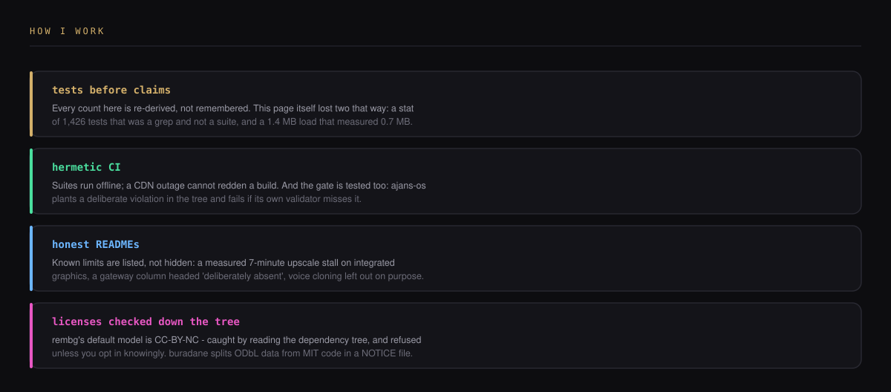

  

**Agent systems, the tooling that keeps them honest, and the infrastructure underneath — small, focused repos that work together.**

I build the plumbing AI agents sit on. An agency operating system designed
research-first, sub-agents that answer in Turkish and know this machine's traps,
a usage-intelligence platform that says where the tokens went. Under that: async
job orchestration, pipeline DAGs, provenance and cost math, and the MCP servers
agents actually call. Some evenings a browser game instead.

---

## This week

Two things, both finished end to end rather than left at 80%.

**ajans-os** — an AI agency operating system built in five phases: read 40 agent
projects with file-and-line evidence, compare them in one matrix, distill 13
patterns and 11 anti-patterns, settle the architecture in 11 ADRs, then write it.
13 modules, 6 machine-readable contracts, 142 passing tests. Every phase output
was audited by a session other than the one that produced it — 30 review
documents — and the audits found real defects, which is the point of having them.

**turkce-ajanlar** — eight Claude Code sub-agents whose output language is
Turkish, not a translated system prompt. They know PowerShell 5.1 has no `&&`,
that cp1254 breaks a Python tool's stdout before it prints a line, and that a
heredoc quietly eats backslashes. One source in `agents/`, exported to Cursor,
OpenCode, Copilot and Codex, with CI that fails on a stale copy.

These two are the only repos still private, and for a boring reason: a
handful of their commits carry my personal email in the author field, and
publishing would put it in front of every scraper. Everything else here is open.

## Agent systems

- **ajans-os** — research-first agency OS. Nothing enters the architecture
  without four answers: the problem it solves, the failure it prevents, the cost
  it adds, and evidence from two independent projects. Five candidate components
  were refused on that rule and parked in a waiting list with the conditions that
  would let them in written down.
- **turkce-ajanlar** — eight Turkish-speaking sub-agents, three slash commands,
  two skills, a format hook, and an eval suite that caught the agents disobeying
  a rule they had been given.
- **[mcp-vet](https://github.com/Furkiozknn/mcp-vet)** — audits an MCP server
  *before* you install it. Every claim carries a file and a line, it never
  executes what it audits, and it reads the code rather than the star count.

## Tooling & infrastructure

- **[claude-code-intelligence](https://github.com/Furkiozknn/claude-code-intelligence)**
  — where the tokens went, what it cost, and when the quota resets. An OTLP
  receiver, transcript parsing, quota tracking, all local-first.
- **[ai-job-gateway](https://github.com/Furkiozknn/ai-job-gateway)** — submit a
  generative-AI job, get an id back instantly, then poll or take a webhook. A
  provider-agnostic contract with idempotency keys that survive a restart,
  SSRF-guarded signed webhooks, and a queryable dead letter.
- **[ai-workflow-engine](https://github.com/Furkiozknn/ai-workflow-engine)** —
  pipelines as plain YAML DAGs, validated before they run. Cycles, undeclared
  dependencies and unbounded fan-out are rejected at parse time rather than at
  3 a.m.

Supporting cast: <a href="https://github.com/Furkiozknn/prompt-template-manager">prompt-template-manager</a> (prompts versioned in git, so a change is a diff) · <a href="https://github.com/Furkiozknn/model-comparison-harness">model-comparison-harness</a> (same prompt, N providers, one report, and a judge that says <i>unparseable</i> instead of guessing) · <a href="https://github.com/Furkiozknn/asset-provenance-toolkit">asset-provenance-toolkit</a> (which model, job and prompt made this file, written into the file)

## MCP servers — local, keyless

- **[mini-creative-toolkit](https://github.com/Furkiozknn/mini-creative-toolkit)**
  — 23 CPU-only media tools behind one server: background removal, resize,
  thumbnails, GIFs. Twenty-two never leave the machine, and the README names the
  one that does.
- **[nvidia-nim-mcp](https://github.com/Furkiozknn/nvidia-nim-mcp)** — NVIDIA
  NIM's free tier inside Claude Code: image generation, vision, translation, chat.
- **[voice-io-mcp](https://github.com/Furkiozknn/voice-io-mcp)** — speech in and
  out, with a hosted fast path and a fully local, keyless fallback.
- **[local-notes-search-mcp](https://github.com/Furkiozknn/local-notes-search-mcp)**
  — semantic search over your own files. No server, no API key, no upload.

## Products

- **[buradane](https://github.com/Furkiozknn/buradane)** — "what do I need, and
  where is the nearest one?" A need-driven public-space finder for Türkiye:
  toilets, parks, drinking water, mosques, libraries, parking, assembly areas.
  167k OpenStreetMap places across all 81 provinces, with community verification
  gated on consensus so one phone in a shell loop cannot falsify accessibility
  data.
- **[nova-drift](https://github.com/Furkiozknn/nova-drift)** — an endless browser
  space-runner. Real bloom post-processing, fully synthesized audio, a seeded
  daily run, adaptive render scaling, and a 0.7 MB first load with no build step.
  **[Play it](https://furkiozknn.github.io/nova-drift/)**

## Research

[AI Creative Platform — architecture and model-landscape notes](research/AI-CREATIVE-PLATFORM-ARASTIRMA-VE-MIMARI.md)
— the research the infrastructure repos grew out of.

---

  
  

