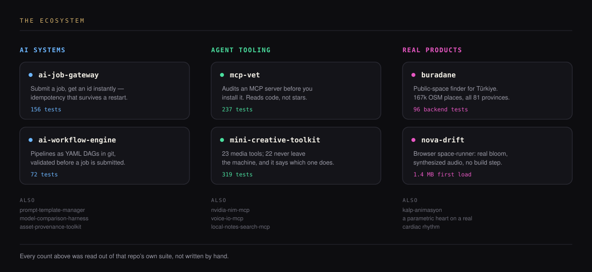

  

  
  
  
  
  
  
  

<i>Sabit bir stack yok — canım ne çekerse: bir gece bir web sitesi, ertesi gün bir tarayıcı oyunu, ondan sonra bir Claude Code eklentisi.</i>

 

  

  <a href="https://furkiozknn.github.io/nova-drift/">nova-drift</a> · 
  <a href="https://furkiozknn.github.io/kalp-animasyon/">kalp-animasyon</a> · 
  <a href="https://github.com/Furkiozknn/mcp-vet">mcp-vet</a> · 
  <a href="https://github.com/Furkiozknn/nvidia-nim-mcp">nvidia-nim-mcp</a> · 
  <a href="https://github.com/Furkiozknn/mini-creative-toolkit">mini-creative-toolkit</a>

  AI creative platform — çalışan omurga: 
  <a href="https://github.com/Furkiozknn/ai-job-gateway">ai-job-gateway</a> · 
  <a href="https://github.com/Furkiozknn/ai-workflow-engine">ai-workflow-engine</a> · 
  <a href="https://github.com/Furkiozknn/prompt-template-manager">prompt-template-manager</a> · 
  <a href="https://github.com/Furkiozknn/model-comparison-harness">model-comparison-harness</a> · 
  <a href="https://github.com/Furkiozknn/asset-provenance-toolkit">asset-provenance-toolkit</a> 
  <a href="https://github.com/Furkiozknn/local-notes-search-mcp">local-notes-search-mcp</a> · 
  <a href="https://github.com/Furkiozknn/voice-io-mcp">voice-io-mcp</a> · 
  <a href="https://github.com/Furkiozknn/buradane">buradane</a>

  <a href="research/AI-CREATIVE-PLATFORM-ARASTIRMA-VE-MIMARI.md">📄 AI Creative Platform — araştırma & mimari notları</a>

 

  
  

