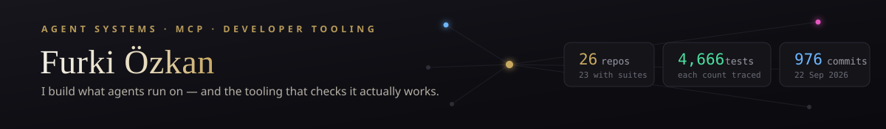

  

**AI systems, agent tooling, and the developer infrastructure that keeps them honest — shipped as small, focused, tested repos that work together.**

I build the plumbing generative-AI products sit on — async job orchestration, pipeline DAGs, provenance and cost math — plus the MCP tooling agents use, and I ship real products on top. Every repo below has CI and a test suite; the claims in their READMEs are written to be checked, not believed.

## AI systems

- **[ai-job-gateway](https://github.com/Furkiozknn/ai-job-gateway)** — Submit a generative-AI job, get an id back instantly, poll or get webhooked: a hardened, provider-agnostic async job server with real keyless providers, not just mocks. Idempotency keys that survive restarts, SSRF-guarded webhooks with signed payloads, jittered retries with a queryable dead letter. *149 tests · CI*
- **[ai-workflow-engine](https://github.com/Furkiozknn/ai-workflow-engine)** — Pipelines as plain YAML DAGs, validated before they run (cycles, undeclared deps, template cross-checks), concurrent where the graph allows — proven end-to-end against a live gateway. *59 tests · e2e-proven*

Supporting cast: [prompt-template-manager](https://github.com/Furkiozknn/prompt-template-manager) (versioned prompt templates with real error surfaces) · [model-comparison-harness](https://github.com/Furkiozknn/model-comparison-harness) (same prompt, N models, one report) · [asset-provenance-toolkit](https://github.com/Furkiozknn/asset-provenance-toolkit) (which model/job/prompt made this file?)

## Agent tooling

- **[mcp-vet](https://github.com/Furkiozknn/mcp-vet)** — A trust-and-security auditor for MCP servers: evidence with file:line for every claim, zero dependencies, and it never executes what it audits. Looks at code, not stars. *237 tests · SECURITY.md · offline audit 0.16 s*
- **[mini-creative-toolkit](https://github.com/Furkiozknn/mini-creative-toolkit)** — 23 local, CPU-first media tools behind one MCP server: no paid APIs, exactly one documented network touchpoint, and a real licensing bug caught by reading the dependency tree (rembg's default model is CC-BY-NC — the toolkit refuses it unless you opt in knowingly). *319 tests*

More MCP servers: [nvidia-nim-mcp](https://github.com/Furkiozknn/nvidia-nim-mcp) · [voice-io-mcp](https://github.com/Furkiozknn/voice-io-mcp) · [local-notes-search-mcp](https://github.com/Furkiozknn/local-notes-search-mcp)

## Real products

- **[buradane](https://github.com/Furkiozknn/buradane)** — "What do I need, and where's the nearest one?" A need-driven public-space finder for Türkiye: FastAPI + PostGIS with consensus-gated community verification (one phone in a shell loop can't falsify accessibility data), a real moderation loop, Alembic migrations, and a MapLibre demo on 37k+ real OSM places across 45 provinces (national fetch ongoing). *82 backend + 145 frontend tests · CI*
- **[nova-drift](https://github.com/Furkiozknn/nova-drift)** — A browser space-runner with real bloom post-processing, fully synthesized audio, a seeded daily challenge, and adaptive render scaling. No build step, 1.4 MB first load, hermetic Playwright CI. **[Play it](https://furkiozknn.github.io/nova-drift/)** · sibling piece: **[kalp-animasyon](https://furkiozknn.github.io/kalp-animasyon/)**, a glowing parametric heart with a real cardiac rhythm.

## Research

[AI Creative Platform — architecture & model-landscape notes](research/AI-CREATIVE-PLATFORM-ARASTIRMA-VE-MIMARI.md) — the research these repos grew out of.

---

**How I work:** tests before claims · hermetic CI (suites run offline; a CDN outage can't redden a build) · honest READMEs (known limits are listed, not hidden) · licenses checked down the dependency tree.

  
  

