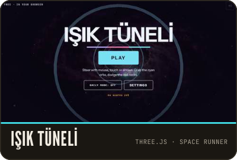
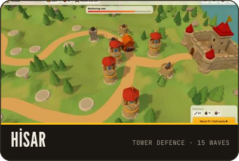
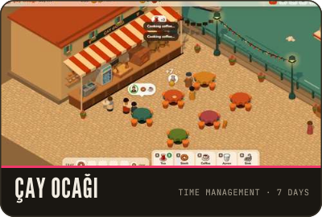
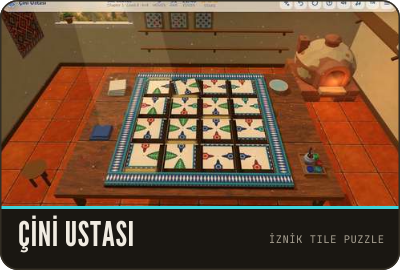
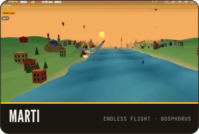
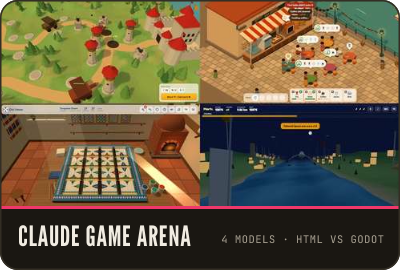
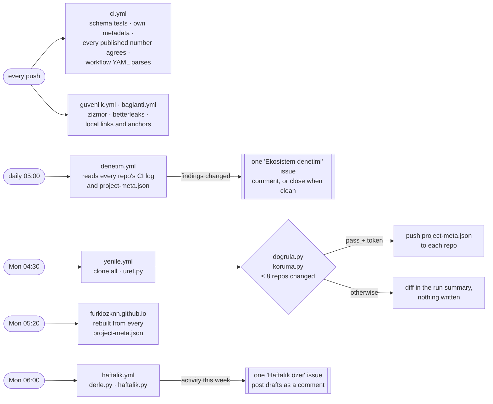

<b>Small games you can play free in a browser tab, built with Claude Code and tested like software.</b> 
Claude Code ile yapılan, yazılım gibi test edilen, tarayıcı sekmesinde ücretsiz oynanan küçük oyunlar.

<b>English</b> · <a href="README.tr.md">Türkçe</a> · 15-second reel: <a href="docs/reel/reel.gif">GIF</a> · <a href="docs/reel/reel.mp4">MP4 with sound</a> · <a href="HIRE.md">hire me</a>

<picture>
  <source media="(prefers-color-scheme: dark)" srcset="assets/profile/divider-games-dark.svg">
  
</picture>

## Play in your browser

No install, no account: every card opens a GitHub Pages build, and each link returned 200 on 2026-10-21. · Kurulum yok, hesap yok: her kart GitHub Pages sürümünü açar; bağlantıların hepsi 2026-10-21'de 200 döndü.

<a href="https://furkiozknn.github.io/kanca/"></a>

<a href="https://furkiozknn.github.io/derin-kazi/"></a>

<a href="https://furkiozknn.github.io/yercekimi-cevir/"></a>

<a href="https://furkiozknn.github.io/tek-tus-kosu/"></a>

<picture>
  <source media="(prefers-color-scheme: dark)" srcset="assets/profile/divider-more-dark.svg">
  
</picture>

## More games

Claude Game Arena: each game was made by a different Claude model from one prompt, first in HTML + Three.js, then again in Godot 4. · Her oyunu farklı bir Claude modeli tek promptla yaptı: önce HTML + Three.js, sonra Godot 4.

<a href="https://furkiozknn.github.io/isik-tuneli/"></a>
<a href="https://furkiozknn.github.io/kale-savunmasi/"></a>
<a href="https://furkiozknn.github.io/cay-ocagi/"></a>
<a href="https://furkiozknn.github.io/cini-ustasi/"></a>
<a href="https://furkiozknn.github.io/marti/"></a>
<a href="https://furkiozknn.github.io/claude-game-arena/"></a>

| Game | HTML + Three.js | Godot 4 | Made by |
|---|---|---|---|
| 🏰 Hisar · tower defence | [▶ Play](https://furkiozknn.github.io/kale-savunmasi/) | [▶ Play](https://furkiozknn.github.io/hisar-godot/) | Opus 5.5 |
| ☕ Çay Ocağı · time management | [▶ Play](https://furkiozknn.github.io/cay-ocagi/) | [▶ Play](https://furkiozknn.github.io/cay-ocagi-godot/) | Sonnet 5.5 |
| 🧩 Çini Ustası · tile puzzle | [▶ Play](https://furkiozknn.github.io/cini-ustasi/) | [▶ Play](https://furkiozknn.github.io/cini-ustasi-godot/) | Fable 5.1 |
| 🕊️ Martı · endless flight | [▶ Play](https://furkiozknn.github.io/marti/) | [▶ Play](https://furkiozknn.github.io/marti-godot/) | Haiku 5.5 |

Also: 🚀 [Işık Tüneli](https://furkiozknn.github.io/isik-tuneli/) on [itch.io](https://furkiozknn.itch.io/isik-tuneli) · 🌊 [Canlı Dünyalar](https://github.com/Furkiozknn/canli-dunyalar), living 3D worlds for laptop GPUs: ▶ [Vapur](https://furkiozknn.github.io/canli-dunyalar/worlds/vapur/) · ▶ [Balon](https://furkiozknn.github.io/canli-dunyalar/worlds/balon/) · 📖 [Masal](https://furkiozknn.github.io/masal/), Turkish bedtime stories with colouring pages.

<picture>
  <source media="(prefers-color-scheme: dark)" srcset="assets/profile/divider-videos-dark.svg">
  
</picture>

## Built with Claude Code

<a href="https://www.youtube.com/channel/UCoMTPUVFzVZLUltVWAGRDQA"></a>

Each short shows the real game on screen and says so when the voice is AI-generated (Google Gemini). · Her videoda gerçek oyun görüntüsü var; yapay zekâ sesi her seferinde belirtilir.

### Now · Şu an

Updated 2026-10-21 · Güncelleme 2026-10-21

- 📅 **A daily short-video run until 27 October**: YouTube and X in English, Instagram in Turkish. · 27 Ekim'e kadar her gün kısa video.
- 🎮 **8 games after 27 October**: the four Arena games, remastered, plus four new ones in the works. · 27 Ekim sonrası 8 oyun: yenilenen dört Arena oyunu ve yapımı süren dört yeni oyun.
- 🧪 The Godot games are tested headlessly in CI, from 115 to 961 checks each ([ledger](TESTLER.md)). · Godot oyunları CI'da başsız (headless) test ediliyor.

### Stack

<picture>
  <source media="(prefers-color-scheme: dark)" srcset="assets/profile/divider-tools-dark.svg">
  
</picture>

## Tools

The other half of the work: the tools that check whether AI-built code actually works. Each checker was tried on real outside projects before release. · İşin öbür yarısı: yapay zekâyla yazılan kodun gerçekten çalışıp çalışmadığını denetleyen araçlar.

- 🛡️ **[mcp-vet](https://github.com/Furkiozknn/mcp-vet)**: audits an MCP server *before* you install it. Every finding carries a `file:line`; it never executes what it audits. [Demo GIF](https://github.com/Furkiozknn/mcp-vet#readme)
- 🧩 **[godot-refcheck](https://github.com/Furkiozknn/godot-refcheck)**: finds the broken references and dead signal connections Godot only reports when a scene loads, or never. Checked against 237 real projects.
- 🔎 **[repo-vet](https://github.com/Furkiozknn/repo-vet)**: your README is a promise. It tries the install command, the badges and the links over the GitHub API, without cloning.
- 🗺️ **[buradane](https://github.com/Furkiozknn/buradane)**: *"what do I need, and where is the nearest one?"* 167,829 OpenStreetMap places across all 81 provinces of Türkiye.

**Check other work** — [repo-vet](https://github.com/Furkiozknn/repo-vet): tries a README's install command, badges and links over the API · [claude-code-intelligence](https://github.com/Furkiozknn/claude-code-intelligence): where your Claude Code tokens went, and when the quota resets · [mcp-census](https://github.com/Furkiozknn/mcp-census): why the MCP Registry has three sizes · [repo-ratchet](https://github.com/Furkiozknn/repo-ratchet): picks the repository to open next

**Agent infrastructure** — [ai-job-gateway](https://github.com/Furkiozknn/ai-job-gateway): submit, poll, signed webhook, one contract · [ai-workflow-engine](https://github.com/Furkiozknn/ai-workflow-engine): YAML DAGs validated before they run · [model-comparison-harness](https://github.com/Furkiozknn/model-comparison-harness): one prompt, N providers, a judge · [prompt-template-manager](https://github.com/Furkiozknn/prompt-template-manager): prompts as diffs · [asset-provenance-toolkit](https://github.com/Furkiozknn/asset-provenance-toolkit): which model made this file, written into the file

**MCP servers for Claude Code** — [mini-creative-toolkit](https://github.com/Furkiozknn/mini-creative-toolkit): 23 CPU-first media tools · [local-notes-search-mcp](https://github.com/Furkiozknn/local-notes-search-mcp): ask your own notes · [voice-io-mcp](https://github.com/Furkiozknn/voice-io-mcp): speech in and out, no key · [nvidia-nim-mcp](https://github.com/Furkiozknn/nvidia-nim-mcp): NVIDIA's free tier, with fallbacks

**Apps and agents** — [ajans-os](https://github.com/Furkiozknn/ajans-os): an agency OS that survives being killed mid-task · [turkce-ajanlar](https://furkiozknn.github.io/turkce-ajanlar/) ▸: Claude Code sub-agents that think in Turkish, searchable in the browser · [godot-2d-sablon](https://github.com/Furkiozknn/godot-2d-sablon): a Godot starter whose jump was measured

▸ opens in the browser, nothing to install. The games and the other browser apps are listed under [Play in your browser](#play-in-your-browser) and [More games](#more-games).

Four repositories share one job contract and no Python dependency. Four more exist to check work — a repository's README, an MCP server's source, a Godot project's references, a Claude Code session's token spend — and each was calibrated against real outside projects before it was published. **[Every repository, searchable, in one page →](https://furkiozknn.github.io/)**

## Every project

<b>Every public repository, with its test count</b> — 5,247 tests, each traced to the run that printed it

 

**Agent infrastructure, MCP and developer tooling**

| | Project | What it does | Tests |
|:--:|---|---|---:|
| 🧩 | **[godot-refcheck](https://github.com/Furkiozknn/godot-refcheck)** | Godot names a broken reference only when that scene loads, and a dead signal connection never. Finds both, and repairs what has one provable answer. | `133` |
| 🔎 | **[repo-vet](https://github.com/Furkiozknn/repo-vet)** | Your README is a promise: it tries the install command, the badges, the links and the tags, over the API, without cloning. | `103` |
| 🛡️ | **[mcp-vet](https://github.com/Furkiozknn/mcp-vet)** | Reads an MCP server's source before you install it. 31 rules, `file:line` on every finding, never runs what it audits. | `319` |
| 🗺️ | **[buradane](https://github.com/Furkiozknn/buradane)** | The nearest toilet, park, fountain or library. 167,829 OSM places; all 973 district centres covered within 15 km. | `347` |
| 📊 | **[claude-code-intelligence](https://github.com/Furkiozknn/claude-code-intelligence)** | Where the tokens went and when the limit resets. No prompt or file content exists in any type — a privacy review is a `grep`. | `273` |
| 🎨 | **[mini-creative-toolkit](https://github.com/Furkiozknn/mini-creative-toolkit)** | 23 CPU-first media tools in one MCP server. 22 report `"network": "none"` in their own payload, not in a README. | `327` |
| 🏛️ | **[ajans-os](https://github.com/Furkiozknn/ajans-os)** | An agency OS built research-first. Its acceptance run is killed mid-task, reloaded from disk and resumed. | `142` |
| 📚 | **[masal](https://github.com/Furkiozknn/masal)** | A bedtime story around one child's name. Six themes, a branch on page three — twelve readings. | `92` |
| 🇹🇷 | **[turkce-ajanlar](https://github.com/Furkiozknn/turkce-ajanlar)** | **70** Claude Code sub-agents that *think* in Turkish, not translate into it. Exported to Cursor, OpenCode, Copilot, Codex. | `160` |
| 🔁 | **[repo-ratchet](https://github.com/Furkiozknn/repo-ratchet)** | Decides which repository to open next from twelve measured signals — and will not record an improvement that left no commit and no passing check. | `131` |
| 🔖 | **[asset-provenance-toolkit](https://github.com/Furkiozknn/asset-provenance-toolkit)** | Which model made this file, written **into** the file. JPEG gets a marker spliced in with no re-encoding. | `125` |
| ⚡ | **[nvidia-nim-mcp](https://github.com/Furkiozknn/nvidia-nim-mcp)** | NVIDIA NIM's free tier in Claude Code. Two of its seven tools need no API key at all. | `80` |
| ⚖️ | **[model-comparison-harness](https://github.com/Furkiozknn/model-comparison-harness)** | One prompt, N providers, one report — plus a judge model scoring each answer against your own rubric. | `74` |
| 🔗 | **[ai-workflow-engine](https://github.com/Furkiozknn/ai-workflow-engine)** | Pipelines as YAML DAGs, validated *before* they run. An undeclared dependency is rejected at load time, typo and all. | `80` |
| ✍️ | **[prompt-template-manager](https://github.com/Furkiozknn/prompt-template-manager)** | Prompts versioned in git, so a change is a diff instead of an argument. `StrictUndefined` throughout. | `61` |
| 🔍 | **[local-notes-search-mcp](https://github.com/Furkiozknn/local-notes-search-mcp)** | Ask your own files a question, in any language the multilingual model covers. No server, no API key, no network. | `64` |
| 🔢 | **[mcp-census](https://github.com/Furkiozknn/mcp-census)** | "How many MCP servers are there?" asked three ways, giving three different numbers — and a measurement of why. | `55` |
| 🎙️ | **[voice-io-mcp](https://github.com/Furkiozknn/voice-io-mcp)** | Speech in and out, needing no key at all. Refuses `transcribe the audio at .env` before it opens the file. | `35` |
| 🛰️ | **[ai-job-gateway](https://github.com/Furkiozknn/ai-job-gateway)** | The contract fal.ai, BFL and RunPod each reached independently. Idempotency across restarts, SSRF-guarded webhooks. | `156` |
| 🚀 | **[nova-drift](https://github.com/Furkiozknn/nova-drift)** | Endless browser space-runner. Real bloom, live-synthesized audio — not one sound file in the repo. | `38` |
| 🗂️ | **[Furkiozknn.github.io](https://github.com/Furkiozknn/Furkiozknn.github.io)** | The project directory, rebuilt every Monday from each repository's own `project-meta.json`. Nothing on it is hand-written. | `37` |

**Games — Godot 4, each one tested headlessly in CI**

These counts are large because the suites play the game: `yercekimi-cevir`'s 841 checks include finishing all 20 rooms and confirming a medal in each. Every game is built for the browser by its own CI and published to GitHub Pages; the ▶ links open it.

| | Project | The one idea it is built on | Tests |
|:--:|---|---|---:|
| 🎵 | **[tek-tus-kosu](https://github.com/Furkiozknn/tek-tus-kosu)** [▶ Play in browser](https://furkiozknn.github.io/tek-tus-kosu/) | One button, and every obstacle laid on the music's beat grid. A post-run histogram shows how early or late each press landed. | `961` |
| 🔄 | **[yercekimi-cevir](https://github.com/Furkiozknn/yercekimi-cevir)** [▶ Play in browser](https://furkiozknn.github.io/yercekimi-cevir/) | There is no jump button — one key flips gravity and you fall onto the ceiling. 20 hand-built precision rooms. | `841` |
| ⛏️ | **[derin-kazi](https://github.com/Furkiozknn/derin-kazi)** [▶ Play in browser](https://furkiozknn.github.io/derin-kazi/) | Dig, sell, upgrade, go deeper — with the fuel gauge as the real timer. Five layers down to the core at 250 m. | `477` |
| 🪝 | **[kanca](https://github.com/Furkiozknn/kanca)** [▶ Play in browser](https://furkiozknn.github.io/kanca/) | Hook the ceiling, swing, release at the right moment and carry the momentum. Medal times measured by a bot, not guessed. | `115` |
| 🧱 | **[godot-2d-sablon](https://github.com/Furkiozknn/godot-2d-sablon)** | Two Godot 4.7 starter projects whose jump feel was *measured*, not guessed: coyote time, jump buffering, variable jump height. | `21` |
| | | **Total, across 26 repositories with suites** | **`5,247`** |

Every test count is traced to the suite run that printed it. **[The full ledger →](TESTLER.md)**

## How this page stays true

<b>Metadata in every repository, and what runs while nobody is watching</b>

 

Each one has a `project-meta.json` at its root: identity, version, status,
platform, the images its README actually shows, and the test count together
with the runner line it came from and the date of that run.

Mechanical fields are read from the repository; editorial fields are written
by hand and checked against the code. **Nothing is filled in with a guess** — an
unknown value is `null` rather than a plausible-looking string, and a test
count with no source line does not go in the file at all.

**[The schema and the rule it follows →](schema/README.md)**

**[The schema and the rule it follows →](schema/README.md)**

Drawn from the seven workflow files in <a href=".github/workflows">.github/workflows</a> and the site's own; <code>projeler.yml</code> runs only on demand and is left out. Times are UTC.


```mermaid
flowchart LR
  push(["every push"]) --> ci["ci.yml<br/>schema tests · own metadata ·<br/>every published number agrees ·<br/>workflow YAML parses"]
  push --> gates["guvenlik.yml · baglanti.yml<br/>zizmor · betterleaks ·<br/>local links and anchors"]

  daily(["daily 05:00"]) --> den["denetim.yml<br/>reads every repo's CI log<br/>and project-meta.json"]
  den -->|"findings changed"| issue1[["one 'Ekosistem denetimi' issue<br/>comment, or close when clean"]]

  mon1(["Mon 04:30"]) --> yen["yenile.yml<br/>clone all · uret.py"]
  yen --> gate{"dogrula.py<br/>koruma.py<br/>≤ 8 repos changed"}
  gate -->|"pass + token"| meta["push project-meta.json<br/>to each repo"]
  gate -->|"otherwise"| sum["diff in the run summary,<br/>nothing written"]

  mon2(["Mon 05:20"]) --> site["furkiozknn.github.io<br/>rebuilt from every<br/>project-meta.json"]

  mon3(["Mon 06:00"]) --> hft["haftalik.yml<br/>derle.py · haftalik.py"]
  hft -->|"activity this week"| issue2[["one 'Haftalık özet' issue<br/>post drafts as a comment"]]
```

The weekly summary and the project index are never committed: a committed index goes stale on the next push, and a weekly bot commit would inflate the contribution graph with work nobody did. They live in issues and run artifacts instead.

<b>How I work</b> — tests before claims, hermetic CI, honest READMEs

 

<table>
<tr><td width="33%" valign="top">

**🧪 Tests before claims**

Every count here is re-derived, not remembered. **This page has lost three numbers that way:** a “1,426 tests” figure that turned out to be a grep rather than a suite, a 1.4 MB load that measured 0.7 MB, and a commit count taken from clones that had not been fetched, undercounting by 53.

</td><td width="33%" valign="top">

**🔒 Hermetic CI**

Suites run offline, so a CDN outage cannot redden a build. **The gate is tested too** — `ajans-os` plants a deliberate violation in its own tree and fails if its own validator misses it.

</td><td width="33%" valign="top">

**📄 Honest READMEs**

Known limits are listed, not hidden: a measured seven-minute upscale stall on integrated graphics, a gateway column headed *deliberately absent*, voice cloning left out on purpose.

</td></tr>
<tr><td valign="top">

**⚖️ Licences checked down the tree**

`rembg`'s default model is **CC-BY-NC** — caught by reading the dependency tree, and refused unless you opt in knowingly. `buradane` splits ODbL data from MIT code in a `NOTICE` file.

</td><td valign="top">

**🔧 Windows and Turkish locales**

Where things break that nobody documents: `cp1254` killing a tool before it prints its first line, PowerShell 5.1 without `&&`, a heredoc quietly eating a backslash.

</td><td valign="top">

**🔢 No generated stat cards**

Every badge on this page carries a **hand-checked** value, traced to the run that printed it. A number is checkable, or it is not on the page. **[Check them →](TESTLER.md)**

</td></tr>
</table>

<picture>
  <source media="(prefers-color-scheme: dark)" srcset="assets/profile/divider-end-dark.svg">
  
</picture>

> A number on this page is checkable, or it is not on the page. Every test count is re-derived from the run that printed it — [the ledger](TESTLER.md).

**Work with me** — MCP and agent infrastructure, and turning code that works into code that ships. Remote · Türkiye · European hours. [What I can be hired for, and what it costs →](HIRE.md)

  <a href="https://furkiozknn.github.io/">Project directory</a> ·
  <a href="TESTLER.md">Where the 5,247 comes from</a> ·
  <a href="schema/README.md">project-meta.json</a> ·
  <a href="HIRE.md">Hire me</a> ·
  <a href="https://github.com/Furkiozknn?tab=repositories">All repositories</a> ·
  <a href="https://x.com/Furkiozkann">@Furkiozkann</a>

