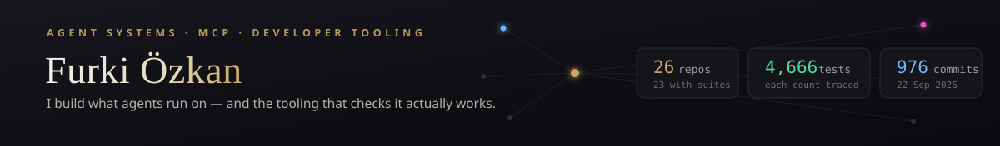
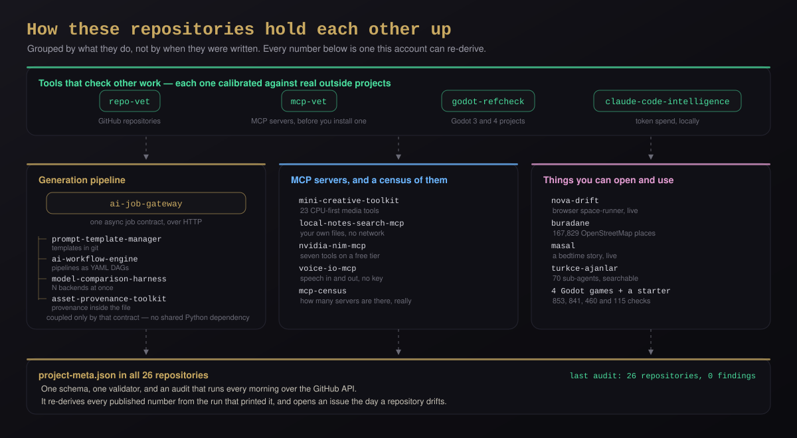
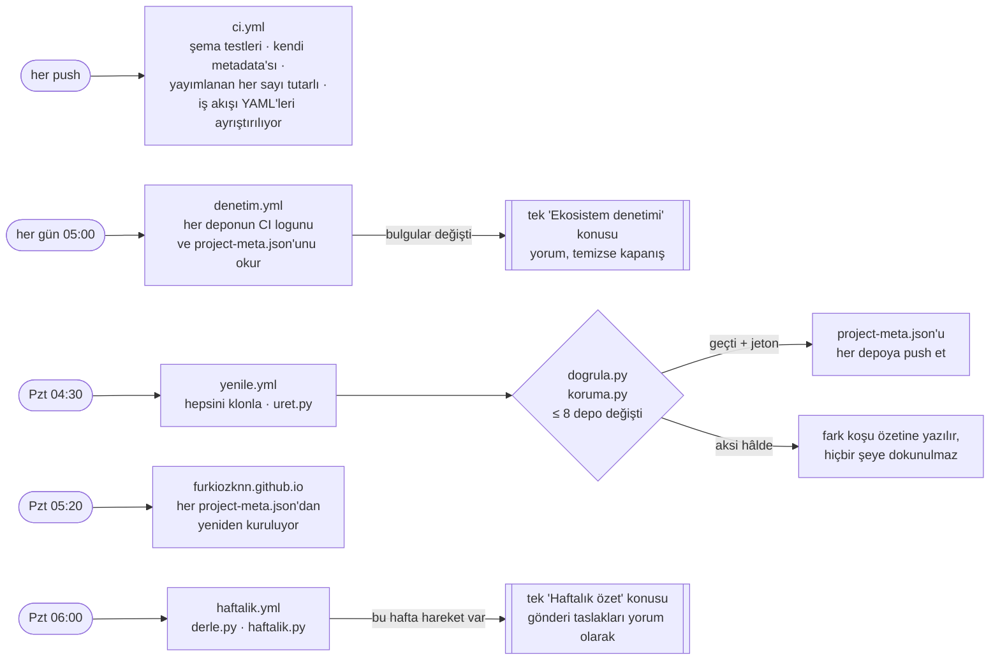

<a href="docs/reel/reel.mp4">Sesli MP4 sürümü</a>

<a href="README.md">English</a> · <b>Türkçe</b>

  
  
  
  

  <b>Yapay zekâ ajanlarının üstünde çalıştığı altyapıyı kuruyorum</b> — asenkron iş sözleşmeleri, pipeline DAG'leri, MCP sunucuları — 
  <b>ve bunların gerçekten çalışıp çalışmadığını denetleyen araçları.</b> 
  Bazı akşamlar da bir oyun motoru.

  
  
  
  
  
  
  
  
  
  

---

## ▸ Kurulum yok, kayıt yok — tıklaman yeterli

<table>
<tr>
<td width="34%" valign="top">

### 🚀 [nova-drift →](https://furkiozknn.github.io/nova-drift/)

**Gerçek bloom post-processing**, tamamen sentezlenmiş ses ve herkesin aynı
haritayı oynadığı tohumlu bir günlük tur içeren sonsuz bir tarayıcı uzay
koşusu. **İlk yükleme 0,7 MB. Derleme adımı yok.** Sen bunu okumayı bitirmeden
uçmaya başlıyor.

</td>
<td width="33%" valign="top">

### 📖 [masal →](https://furkiozknn.github.io/masal/)

**Tek bir çocuğun adı, yaşı ve memleketi** etrafında yazılan bir uyku masalı;
boyama sayfası da sayfanın içine çiziliyor. Türkçe ek motoru, şablon
yerleştirmenin asla doğru yapamayacağı yerde adı doğru çekiyor — *Sinop*
`-ta` alır, *Trabzon* `-da`.

</td>
<td width="33%" valign="top">

### 🇹🇷 [turkce-ajanlar →](https://furkiozknn.github.io/turkce-ajanlar/)

**70** Claude Code alt ajanının hepsi, bir şey kurmadan önce tarayıcıda
aranabilir. `/` arama kutusuna atlar, `Enter` ilk sonucu açar. Birini almak,
**tek bir markdown dosyasını** `.claude/agents/` içine kopyalamak demek.

</td>
</tr>
</table>

  

<b>Gerçek bir oturum, o depoda commit'li bir betikle kaydedildi.</b> “ücretsiz tuvalet” yazmak <b>167.829 yeri</b> en yakın 19 ücretsiz tuvalete indiriyor.

---

## ▸ Bu yirmi yedi ayrı yan proje değil, tek bir sistem

<b><a href="https://furkiozknn.github.io/">Bütün depolar, tek sayfada, aranabilir →</a></b> 
Her deponun taşıdığı <code>project-meta.json</code>'dan üretiliyor, her hafta yeniden kuruluyor. Üzerinde elle yazılmış hiçbir şey yok.

Dört depo tek bir iş sözleşmesini paylaşıyor ve hiçbir Python bağımlılığı paylaşmıyor. Dört depo daha başka işleri denetlemek için var — bir deponun README'sini, bir MCP sunucusunun kaynağını, bir Godot projesinin referanslarını, bir Claude Code oturumunun token harcamasını — ve her biri yayımlanmadan önce gerçek dış projelere karşı kalibre edildi. Hepsinin altında tek bir metadata şeması ve her sabah çalışan tek bir denetim.

---

## ▸ Buradan başla

> 🛡️ **[mcp-vet](https://github.com/Furkiozknn/mcp-vet)** — bir MCP sunucusunu *kurmadan önce* denetler. Her iddia bir dosya ve satır taşır, yıldız sayısını değil kodu okur ve **denetlediği şeyi asla çalıştırmaz**. Yalnızca standart kütüphane, sıfır bağımlılık. `319 test`
>
> 🧩 **[godot-refcheck](https://github.com/Furkiozknn/godot-refcheck)** — Godot kırık bir referansı ancak o sahne yüklendiğinde söyler, ölü bir sinyal bağlantısını ise hiç söylemez. Bu araç ikisini de editörü açmadan bulur ve **tek ve kanıtlanabilir bir cevabı olanları onarır**. **237 gerçek Godot projesine** ve başsız (headless) bir motora karşı denendi. `133 test`
>
> 🔎 **[repo-vet](https://github.com/Furkiozknn/repo-vet)** — README'n bir sözdür: kurulum komutunu, rozetleri, bağlantıları ve sürüm zincirini GitHub API'si üzerinden, klonlamadan dener. Çalışan projelerde sessiz kalsın diye **30 herkese açık depoda** kalibre edildi. `103 test`
>
> 🗺️ **[buradane](https://github.com/Furkiozknn/buradane)** — *"neye ihtiyacım var ve en yakını nerede?"* Türkiye'nin 81 ilinin hepsinde **167.829 gerçek OpenStreetMap yeri**; FastAPI + PostGIS üstünde, Next.js/MapLibre ön yüzüyle. `347 test`
>
> 📊 **[claude-code-intelligence](https://github.com/Furkiozknn/claude-code-intelligence)** — token'lar nereye gitti, ne tuttu ve kota ne zaman sıfırlanıyor. **Hiçbir yere veri göndermeyen** bir OTLP alıcısı ve transkript ayrıştırıcısı. `273 test`

  

<b>Gerçek bir koşu, o depoda commit'li bir fikstür üzerinde.</b> Taşınan bir klasörün kırdığı üç referans, üç onarım, ardından temiz bir geçiş — ve başsız bir Godot hem öncesinde hem sonrasında aynı fikirde.

---

## ▸ Hepsi, tek tabloda

Aşağıdaki her test sayısı, onu yazdıran suit koşusuna kadar izlenebilir. **[Tam defter →](TESTLER.md)**

### Ajan altyapısı, MCP ve geliştirici araçları

| | Proje | Ne yapar | Test |
|:--:|---|---|---:|
| 🧩 | **[godot-refcheck](https://github.com/Furkiozknn/godot-refcheck)** | Godot kırık referansı ancak sahne yüklenince söyler, ölü sinyal bağlantısını hiç söylemez. İkisini de bulur, tek kanıtlanabilir cevabı olanı onarır. | `133` |
| 🔎 | **[repo-vet](https://github.com/Furkiozknn/repo-vet)** | README'n bir sözdür: kurulum komutunu, rozetleri, bağlantıları ve etiketleri API üzerinden, klonlamadan dener. | `103` |
| 🛡️ | **[mcp-vet](https://github.com/Furkiozknn/mcp-vet)** | Bir MCP sunucusunun kaynağını sen kurmadan önce okur. 31 kural, her bulguda `dosya:satır`, denetlediğini asla çalıştırmaz. | `319` |
| 🗺️ | **[buradane](https://github.com/Furkiozknn/buradane)** | En yakın tuvalet, park, çeşme ya da kütüphane. 167.829 OSM yeri; 973 ilçe merkezinin hepsi 15 km içinde kapsanıyor. | `347` |
| 📊 | **[claude-code-intelligence](https://github.com/Furkiozknn/claude-code-intelligence)** | Token'lar nereye gitti ve limit ne zaman sıfırlanıyor. Hiçbir tipte prompt ya da dosya içeriği yok — gizlilik incelemesi bir `grep`'ten ibaret. | `273` |
| 🎨 | **[mini-creative-toolkit](https://github.com/Furkiozknn/mini-creative-toolkit)** | Tek MCP sunucusunda 23 CPU-öncelikli medya aracı. 22'si `"network": "none"` bilgisini README'de değil kendi çıktısında bildiriyor. | `327` |
| 🏛️ | **[ajans-os](https://github.com/Furkiozknn/ajans-os)** | Önce araştırmayla kurulmuş bir ajans işletim sistemi. Kabul koşusu görevin ortasında öldürülüyor, diskten yeniden yükleniyor ve kaldığı yerden sürüyor. | `142` |
| 📚 | **[masal](https://github.com/Furkiozknn/masal)** | Tek bir çocuğun adı etrafında bir uyku masalı. Altı tema, üçüncü sayfada bir yol ayrımı — on iki farklı okuma. | `92` |
| 🇹🇷 | **[turkce-ajanlar](https://github.com/Furkiozknn/turkce-ajanlar)** | Türkçeye çevrilmek yerine Türkçe *düşünen* **70** Claude Code alt ajanı. Cursor, OpenCode, Copilot ve Codex'e aktarılıyor. | `160` |
| 🔁 | **[repo-ratchet](https://github.com/Furkiozknn/repo-ratchet)** | Sıradaki depoyu on iki ölçülmüş sinyalden seçer — ve commit'i, geçen bir kontrolü olmayan bir iyileştirmeyi kaydetmez. | `131` |
| 🔖 | **[asset-provenance-toolkit](https://github.com/Furkiozknn/asset-provenance-toolkit)** | Bu dosyayı hangi modelin ürettiği, dosyanın **içine** yazılır. JPEG'e yeniden kodlama olmadan bir işaret eklenir. | `125` |
| ⚡ | **[nvidia-nim-mcp](https://github.com/Furkiozknn/nvidia-nim-mcp)** | NVIDIA NIM'in ücretsiz katmanı Claude Code'da. Yedi aracından ikisi hiç API anahtarı istemiyor. | `80` |
| ⚖️ | **[model-comparison-harness](https://github.com/Furkiozknn/model-comparison-harness)** | Tek prompt, N sağlayıcı, tek rapor — üstüne her cevabı senin ölçütlerine göre puanlayan bir hakem model. | `74` |
| 🔗 | **[ai-workflow-engine](https://github.com/Furkiozknn/ai-workflow-engine)** | YAML DAG olarak pipeline'lar, çalışmadan *önce* doğrulanır. Bildirilmemiş bir bağımlılık, yazım hatasıyla birlikte, yüklenirken reddedilir. | `80` |
| ✍️ | **[prompt-template-manager](https://github.com/Furkiozknn/prompt-template-manager)** | Git'te sürümlenen prompt'lar; bir değişiklik tartışma değil diff olur. Baştan sona `StrictUndefined`. | `61` |
| 🔍 | **[local-notes-search-mcp](https://github.com/Furkiozknn/local-notes-search-mcp)** | Kendi dosyalarına, çok dilli modelin kapsadığı herhangi bir dilde soru sor. Sunucu yok, API anahtarı yok, ağ yok. | `64` |
| 🔢 | **[mcp-census](https://github.com/Furkiozknn/mcp-census)** | "Kaç MCP sunucusu var?" sorusu üç şekilde soruluyor, üç farklı sayı çıkıyor — ve nedeni ölçülüyor. | `55` |
| 🎙️ | **[voice-io-mcp](https://github.com/Furkiozknn/voice-io-mcp)** | Hiç anahtar gerektirmeden ses girişi ve çıkışı. `.env içindeki sesi yazıya dök` isteğini dosyayı açmadan reddeder. | `35` |
| 🛰️ | **[ai-job-gateway](https://github.com/Furkiozknn/ai-job-gateway)** | fal.ai, BFL ve RunPod'un birbirinden bağımsız olarak vardığı sözleşme. Yeniden başlatmalar arasında idempotency, SSRF korumalı webhook'lar. | `156` |
| 🚀 | **[nova-drift](https://github.com/Furkiozknn/nova-drift)** | Sonsuz tarayıcı uzay koşusu. Gerçek bloom, canlı sentezlenen ses — depoda tek bir ses dosyası yok. | `38` |
| 🗂️ | **[Furkiozknn.github.io](https://github.com/Furkiozknn/Furkiozknn.github.io)** | Proje dizini; her pazartesi, her deponun kendi `project-meta.json`'undan yeniden kuruluyor. Üzerinde elle yazılmış hiçbir şey yok. | `37` |

### Oyunlar — Godot 4, her biri CI'da başsız test ediliyor

Bu sayılar büyük, çünkü suitler oyunu oynuyor: `yercekimi-cevir`'in 841 kontrolü 20 odanın hepsini bitirmeyi ve her birinde bir madalya doğrulamayı da içeriyor. Her depoda Windows ve web (HTML5) dışa aktarma ön ayarları var; henüz barındırılan bir sürüm yok.

| | Proje | Üstüne kurulduğu tek fikir | Test |
|:--:|---|---|---:|
| 🎵 | **[tek-tus-kosu](https://github.com/Furkiozknn/tek-tus-kosu)** | Tek tuş, ve her engel müziğin vuruş ızgarasına diziliyor. Tur sonundaki histogram her basışın ne kadar erken ya da geç geldiğini gösteriyor. | `961` |
| 🔄 | **[yercekimi-cevir](https://github.com/Furkiozknn/yercekimi-cevir)** | Zıplama tuşu yok — tek tuş yerçekimini çeviriyor ve tavana düşüyorsun. Elle kurulmuş 20 hassas oda. | `841` |
| ⛏️ | **[derin-kazi](https://github.com/Furkiozknn/derin-kazi)** | Kaz, sat, geliştir, daha derine in — asıl zamanlayıcı yakıt göstergesi. 250 m'deki çekirdeğe kadar beş katman. | `477` |
| 🪝 | **[kanca](https://github.com/Furkiozknn/kanca)** | Tavana kanca at, sallan, doğru anda bırak ve momentumu taşı. Madalya süreleri tahmin değil, bir botla ölçüldü. | `115` |
| 🧱 | **[godot-2d-sablon](https://github.com/Furkiozknn/godot-2d-sablon)** | Zıplama hissi tahmin edilmek yerine *ölçülmüş* iki Godot 4.7 başlangıç projesi: kojot süresi, zıplama tamponu, değişken zıplama yüksekliği. | `21` |
| | | **Toplam, suiti olan 26 depoda** | **`5.247`** |

---

## ▸ Her depo kendi metadata'sını taşıyor

Her birinin kökünde bir `project-meta.json` var: kimlik, sürüm, durum, platform,
README'nin gerçekten gösterdiği görseller, ve test sayısı — onu yazdıran
koşucu satırı ve o koşunun tarihiyle birlikte.

Mekanik alanlar depodan okunuyor; editoryal alanlar elle yazılıyor ve koda karşı
kontrol ediliyor. **Hiçbir şey tahminle doldurulmuyor** — bilinmeyen bir değer
makul görünen bir metin değil `null`, ve kaynak satırı olmayan bir test sayısı
dosyaya hiç girmiyor.

**[Şema ve uyduğu kural →](schema/README.md)**

---

## ▸ Kimse bakmıyorken çalışanlar

<a href=".github/workflows">.github/workflows</a> içindeki beş iş akışından ve sitenin kendi iş akışından çizildi. Saatler UTC.

Haftalık özet ve proje dizini hiçbir zaman commit'lenmiyor: commit'li bir dizin bir sonraki push'ta eskir, haftalık bir bot commit'i de katkı grafiğini kimsenin yapmadığı bir emekle şişirirdi. Bunun yerine konularda ve koşu çıktılarında duruyorlar.

---

## ▸ Nasıl çalışıyorum

<table>
<tr><td width="33%" valign="top">

### 🧪 İddiadan önce test

Buradaki her sayı hatırlanmıyor, yeniden türetiliyor. **Bu sayfa bu yüzden üç sayı kaybetti:** bir suit değil bir grep çıktısı olduğu anlaşılan “1,426 test”, 0,7 MB ölçülen bir 1,4 MB yükleme, ve çekilmemiş klonlardan alınıp 53 eksik sayan bir commit sayısı.

</td><td width="33%" valign="top">

### 🔒 Hermetik CI

Suitler çevrimdışı çalışıyor; bir CDN kesintisi derlemeyi kırmızıya çeviremez. **Kapının kendisi de test ediliyor** — `ajans-os` kendi ağacına kasıtlı bir ihlal yerleştiriyor ve kendi doğrulayıcısı onu kaçırırsa başarısız oluyor.

</td><td width="33%" valign="top">

### 📄 Dürüst README'ler

Bilinen sınırlar saklanmıyor, listeleniyor: tümleşik grafikte ölçülmüş yedi dakikalık bir büyütme takılması, başlığı *bilerek yok* olan bir gateway sütunu, bilerek dışarıda bırakılmış ses klonlama.

</td></tr>
<tr><td valign="top">

### ⚖️ Lisanslar ağacın dibine kadar kontrol ediliyor

`rembg`'nin varsayılan modeli **CC-BY-NC** — bağımlılık ağacı okunarak yakalandı ve bilerek açmadıkça reddediliyor. `buradane`, ODbL veriyi MIT koddan bir `NOTICE` dosyasıyla ayırıyor.

</td><td valign="top">

### 🔧 Windows ve Türkçe yerel ayarlar

Kimsenin belgelemediği yerlerde işlerin bozulduğu yer: bir aracı ilk satırını basmadan öldüren `cp1254`, `&&` bilmeyen PowerShell 5.1, bir ters bölüyü sessizce yutan heredoc.

</td><td valign="top">

### 🔢 Üretilmiş istatistik kartı yok

Bu sayfadaki her rozet **elle kontrol edilmiş** bir değer taşıyor ve onu yazdıran koşuya kadar izlenebiliyor. Bir sayı ya kontrol edilebilir ya da sayfada yok. **[Kontrol et →](TESTLER.md)**

</td></tr>
</table>

---

## ▸ Uzaktan sözleşmeli iş için müsait

**MCP ve ajan altyapısı** · **çalışan kodu yayımlanabilir koda dönüştürmek** 
Uzaktan · Türkiye · Avrupa saatleri

### [→ Ne için işe alınabilirim ve ücreti ne](HIRE.md)

 

  <a href="https://furkiozknn.github.io/">Proje dizini</a> ·
  <a href="TESTLER.md">5.247 testin kaynağı</a> ·
  <a href="schema/README.md">project-meta.json</a> ·
  <a href="HIRE.md">İşe al</a> ·
  <a href="https://github.com/Furkiozknn?tab=repositories">Bütün depolar</a> ·
  <a href="https://x.com/furkiozkan">@furkiozkan</a>

